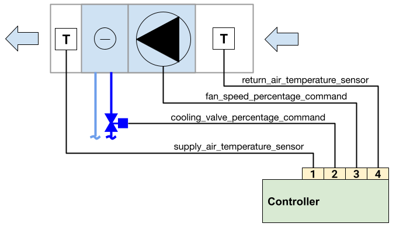
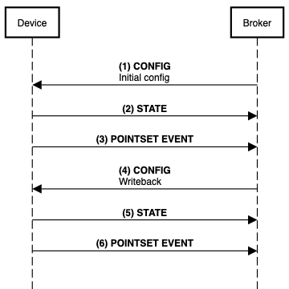

# UDMI example

**Recommended reading**
- [Tech primer](../tech_primer.md)
- [UDMI documentation ](../)

This document describes a real world basic implementation of UDMI using a fan coil unit system as an
example

## Physical Setup

For this example, the sample fan coil unit system comprises 
- Fan
- Cooling coil and valve
- Supply & return air temperature sensor
- Fan coil unit controller



UDMI is implemented at the fan coil unit controller, which has an internet connection, and a UDMI  MQTT client

The approach here is consistant with the [Digital Buildings Ontology (DBO)](../tech_primer.md). Conversely it is also possible and valid to represent each
component as a logical device subject to project requirements

The system has the following physical points, represented as analogue inputs/outputs on the controller
- `cooling_valve_percentage_command`
- `supply_air_temperature_sensor`
- `return_air_temperature_sensor`
- `fan_speed_percentage_command`

The system additionally comprises the following virtual points
- `zone_air_temperature_setpoint`"

These points have been named according to [DBO](../tech_primer.md) at the controller.

This is an example, in practice the system may comprise additional components and points
not shown in the example. These would be incorporated in the same way. There are different ways and connectivity options to achiee the same functionality e.g. using [gateways](../specs/gateway.md)


## Site Model & Metadata

Metadata file saved as a `FCU-001/metadata.json` within the [site model](../specs/site_model.md). 

```json
{
  "version": 1,
  "timestamp": "2018-08-26T21:39:29.364Z",
  "system": {
    "location": {
      "site": "US-SFO-XYY",
      "section": "NW-2F",
    },
    "physical_tag": {
      "asset": {
        "guid": "bim://04aEp5ymD_$u5IxhJN2aGi",
        "site": "US-SFO-XYY",
        "name": "FCU-001"
      }
    }
  },
  "cloud": {
    "auth_type": "ES256"
  },
  "pointset": {
    "points": {
      "cooling_valve_percentage_command": {
        "units": "Percent",
      },
      "supply_air_temperature_sensor": {
        "units": "Degrees-Celsius",
      },
      "return_air_temperature_sensor": {
        "units": "Degrees-Celsius",
      },
      "fan_speed_percentage_command": {
        "units": "Percent",
      },
      "zone_air_temperature_setpoint": {
        "writeable": true,
        "units": "Degrees-Celsius",
      }
    }
  }
}

```

Additional fields baseline values and testing targets omitted. It is recommended these are filled where available and to 

## Message Flow



### Initiliasation 
#### (1) Initial Configuration
Using the registrar tool, a configuration message is sent based on metadata

```json
{
  "version": 1,
  "timestamp": "2018-08-26T21:39:29.364Z",
  "system": {
    "min_loglevel": 500
  },
  "pointset": {
    "sample_limit_sec": 2,
    "sample_rate_sec": 500,
    "points": {
      "cooling_valve_percentage_command": {
      },
      "supply_air_temperature_sensor": {
      },
      "return_air_temperature_sensor": {
      },
      "fan_speed_percentage_command": {
      },
      "zone_air_temperature_setpoint": {
      }
    }
  }
}

```

- `cooling_valve_percentage_command`
- `supply_air_temperature_sensor`
- `return_air_temperature_sensor`
- `fan_speed_percentage_command`

The system additionally comprises the following virtual points
- `zone_air_temperature_setpoint`"

#### (2) State
link to sequence and state


### Operation

#### (3) Telemetry (Pointset Event)


### Writeback 

#### (4) Config 

#### (5) State

#### (6) Telemetry


```
participant Device
participant Broker
participantspacing 10
Broker->Device: **(1) CONFIG**\nInitial config
Device->Broker: **(2) STATE**
Device->Broker: **(3) POINTSET EVENT**
Broker->Device: **(4) CONFIG**\nWriteback
Device->Broker: **(5) STATE**
Device->Broker: **(6) POINTSET EVENT**
```