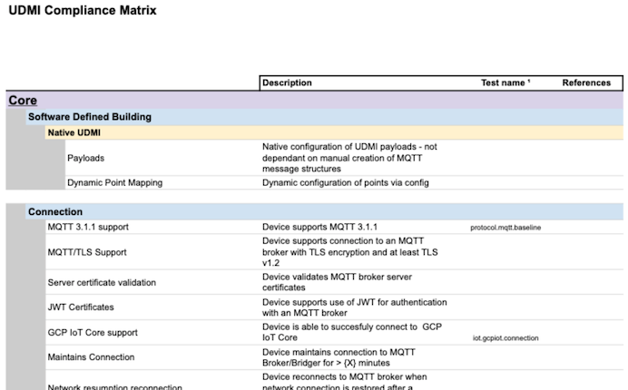

[**UDMI**](../../) / [**Docs**](../) / [**Specs**](./)
/ [Compliance](#)

# UDMI Compliance

This is an overview of what it means for a device to be "UDMI Compliant."
There are several different facets to UDMI, each providing a different
bit of functionality, so the actual requirements will depend on the
intended function of the device.

* [_pointset_ telemetry](../messages/pointset.md), used for basic telemetry ingestion.
* [_writeback_ control](./sequences/writeback.md), used for on-prem device control.
* [_gateway_ proxy](gateway.md), used to proxy data for non-MQTT devices.
* [_system_ basics](../messages/system.md), used for general monitoring and logging.

## Compliance Matrix

The [compliance matrix](compliance_matrix.pdf) provides an overview of many of the functionality defined within UDMI broken
down into smaller individual feature sets. This aids in assessing levels or completeness of
compliance of a device and can be used for defining requirements.

## Testing

Valdators (validator, sequencor)

DAQ - automated to run all of these (link to cloud test)